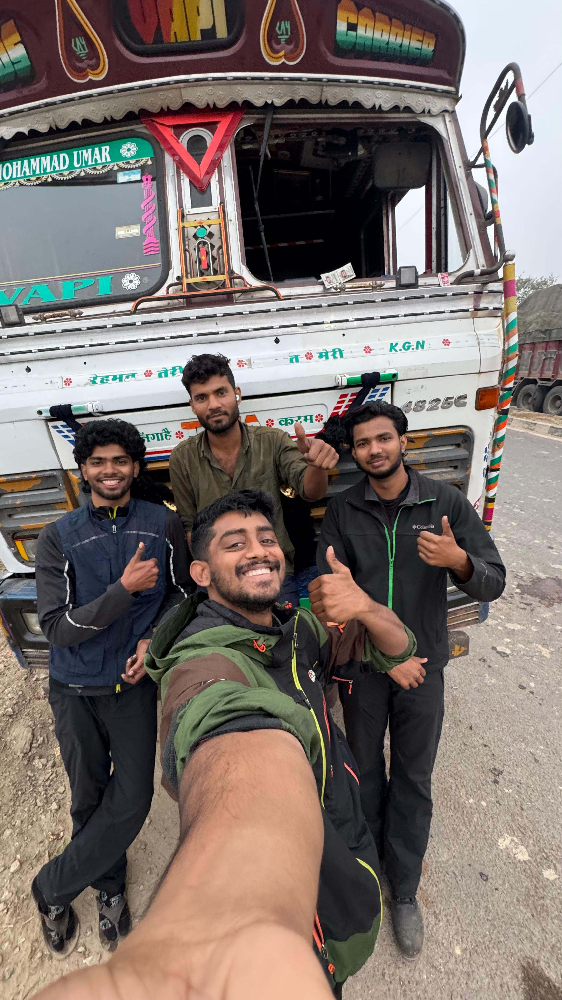
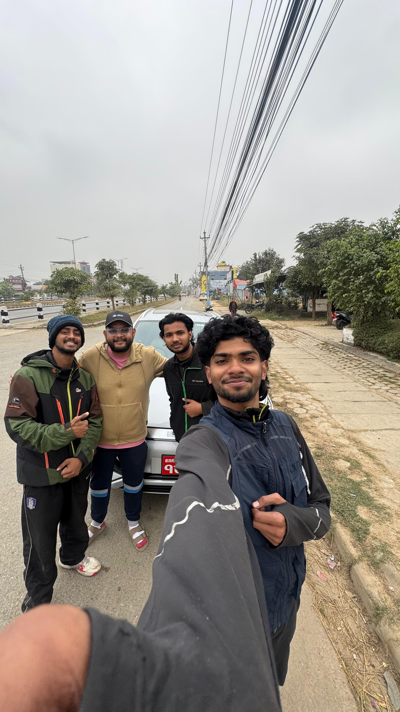
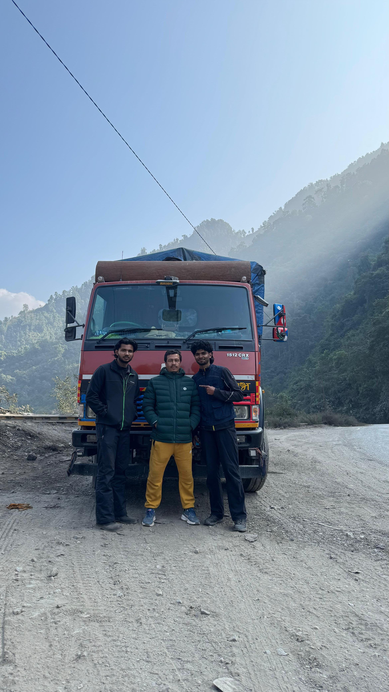
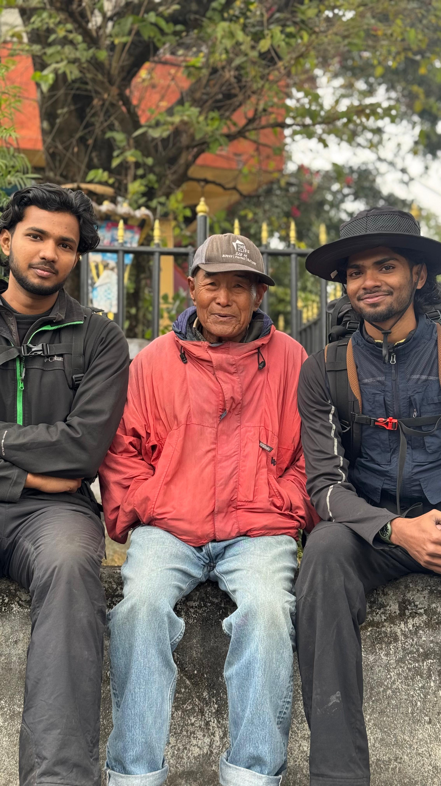
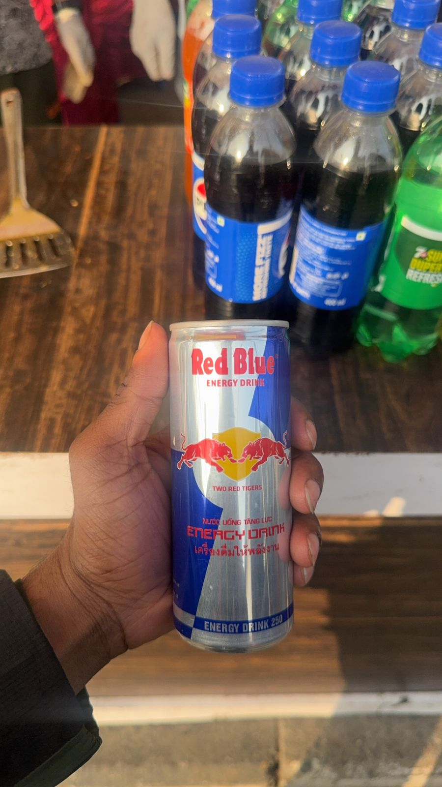
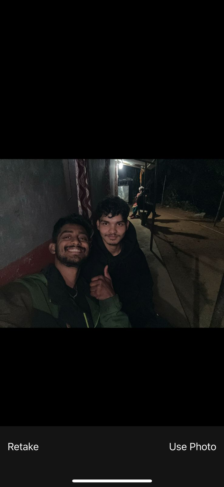
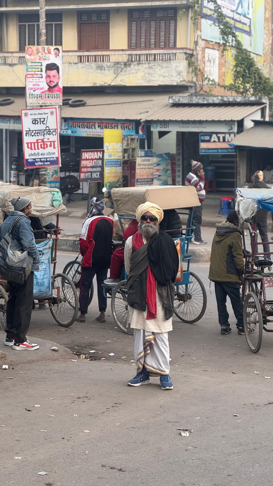
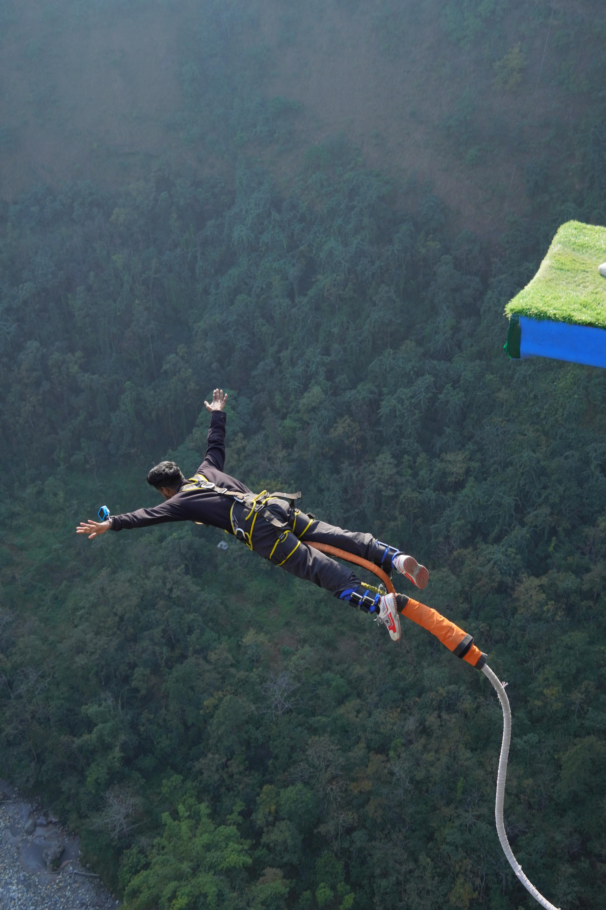

It all began on a chilly morning in Phagwara, Punjab. Three friends—Sanjai, Fadhil, and Hafeeem—decided to embark on an unforgettable adventure: hitchhiking to Nepal for bungee jumping in Kushma. With a budget of just ₹3,000 for 8 days and ₹6,000 for bungee jumping, we were ready to test our limits and make memories that would last a lifetime.

<!--more-->

## Chapter 1: The Journey Begins

We started our journey from Jouned, full of excitement and a little nervousness. Our first ride came from a lorry driver named Fasal. He was a character—loud, funny, and slightly drunk, but he got us safely to our next stop.

 <!-- Image 1: Fasal in his lorry -->

 <!-- Video 1: Traveling with Fasal -->

## Chapter 2: The Kindness of Strangers

From Sonoili to Butwal, we hitched a ride with Nitish Pathway in his BYD car. He was a quiet, kind man who shared stories about his travels and even bought us tea at a roadside dhaba.

 <!-- Image 2: Nitish and his BYD car -->

## Chapter 3: The Scammer

Not everyone we met was kind. One guy promised to take us to Kushma but dropped us halfway after taking some money. It was a lesson learned, but we didn’t let it dampen our spirits.

 <!-- Image 3: The scammer -->

## Chapter 4: Meeting Locals

Along the way, we met an old Nepali man who shared his lunch with us. His warmth and hospitality reminded us why we love traveling.

 <!-- Image 4: Old Nepali man -->

 <!-- Video 2: Little boy showing middle finger -->

## Chapter 5: Fake Redbull and Tent Space

In Nepal, we discovered the infamous fake Redbull. It tasted... interesting. That night, a kind local offered us space to pitch our tent. He even shared his dinner with us.

 <!-- Image 5: Fake Redbull -->

 <!-- Image 6: Tent space -->

## Chapter 6: The Swag Uncle

One of the highlights of the trip was meeting a swag uncle who gave us a ride and entertained us with his stories and jokes. He was the life of the party!

 <!-- Image 7: Swag uncle -->

## Chapter 7: Bungee Jumping in Kushma

Finally, we reached Kushma. The bungee jumping experience was worth every penny. The adrenaline rush as we jumped off the bridge was indescribable.

 <!-- Image 8: Sanjai jumping -->

 <!-- Video 3: Hafeeem jumping -->

## Chapter 8: Reflections

This trip cost us only ₹3,000 for 8 days, with an additional ₹6,000 for bungee jumping. It was a budget trip, but the experiences were priceless. From the kindness of strangers to the hilarious misadventures, every moment was unforgettable.

---

This journey taught us that the best adventures come from stepping out of your comfort zone and embracing the unknown. Nepal, with its breathtaking landscapes and warm-hearted people, will always hold a special place in our hearts.

> "Traveling—it leaves you speechless, then turns you into a storyteller." – Ibn Battuta